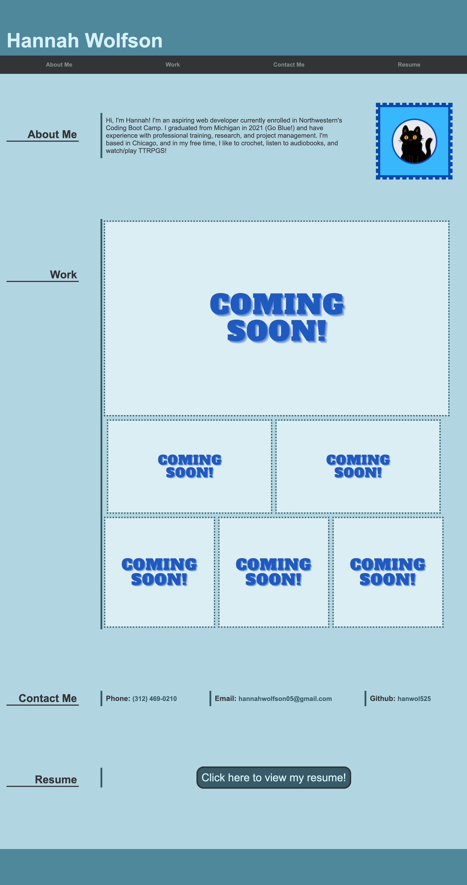

# 02-Portfolio

## Project Description
This is a portfolio page to be updated with projects as the course progresses. It includes a short bio, a "Work" sections with linked placeholders, contact information, and a linked resume.

<a href="https://hanwol525.github.io/02-Portfolio/">Deployed page</a>

 

## Technology Used
<ul>
    <li> HTML - Provides site structure and basic content
    <li> CSS - Provides style for the site
    <li> Canva - Used for all external designs (avatar, placeholder images, resume)
</ul>

 

## Overview of Site

 

## Summary
<ul>
    <li> Used HTML to set basic section structure and populate the page
    <li> Used CSS to add style to webpage content
    <li> Used CSS to create responsive design with flexbox and media queries
</ul>

 

## Resources Used
<ul>
    <li><a href="https://www.canva.com/">Canva</a>
    <li><a href="https://codepen.io/pythagoras1357/pen/ezXgrm">Code for centering "Coming Soon!" text on the placeholder webpage </a>(found via <a href="https://stackoverflow.com/questions/7948333/css-position-text-in-the-middle-of-the-page"> this Stackoverflow question</a>)
    <li><a href="https://responsively.app/">Responsively</a> for monitoring changes to responsive design
    <li><a href="https://html-color-codes.info/colors-from-image/">HTML Color Codes</a> for extracting color codes from images
</ul>

 

## Author Links
<ul>
    <li>Github: <a href="https://github.com/hanwol525">hanwol525</a>
</ul>
